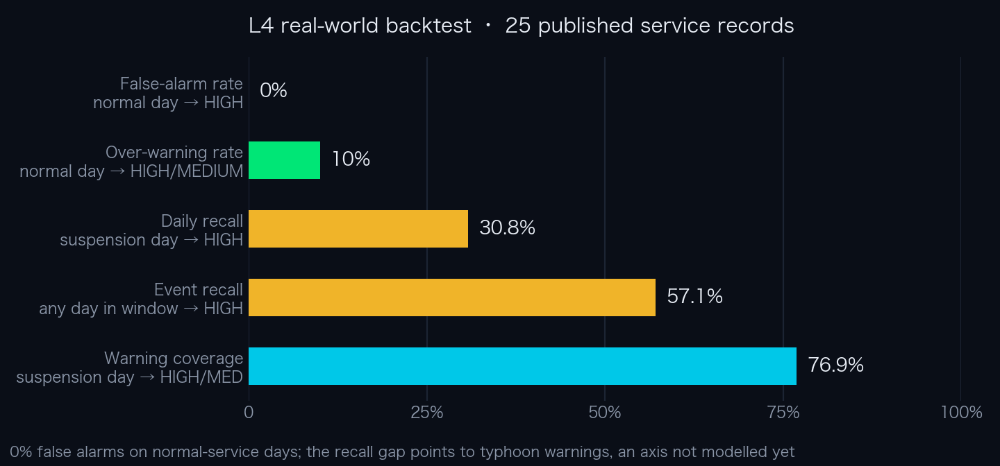
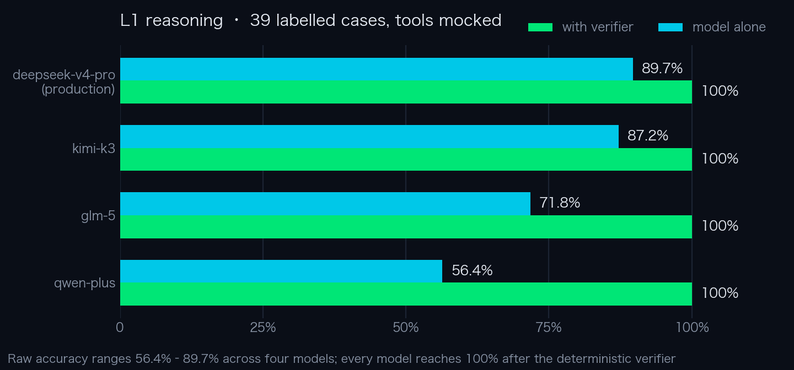

<p align="center">
  
</p>

<p align="center">
  <a href="https://voyageguard-two.vercel.app"><strong>Live demo</strong></a> &middot;
  <a href="#usage"><strong>Usage</strong></a> &middot;
  <a href="#architecture"><strong>Architecture</strong></a> &middot;
  <a href="#evaluation"><strong>Evaluation</strong></a> &middot;
  <a href="#documentation"><strong>Docs</strong></a> &middot;
  <a href="README.md"><strong>中文</strong></a>
</p>

<p align="center">
  <a href="https://voyageguard-two.vercel.app"></a>
  
  <a href="evals/l3_sufficiency.py"></a>
  <a href="evals/golden/events.jsonl"></a>
  
  <a href="LICENSE"></a>
</p>

# VoyageGuard · Weather-Risk Decision Agent

**You've booked a flight or a ferry, and a gale is coming. Do you still go?**

VoyageGuard checks live weather data against officially published warning criteria and navigation restrictions, determines
whether any official threshold is crossed on the day of travel, and cites the source for every finding. When the required
evidence is incomplete, it returns "insufficient evidence" instead of a risk level. It covers flights and ferries, with a Chinese and an English UI.

<table>
  <tr><td width="96"><b>Problem</b></td><td>Airline and ferry apps report only services already cancelled, weather apps provide raw numbers, and official notices are delayed and scattered. No layer maps weather figures onto official thresholds</td></tr>
  <tr><td width="96"><b>Approach</b></td><td>Code pre-fetches the required evidence → the model explains and advises → a rule engine outside the model loop makes the final determination</td></tr>
  <tr><td width="96"><b>Output</b></td><td>A risk level plus sourced triggers (regulation / official warning / product rule); a fourth verdict, <code>UNKNOWN</code>, when evidence is insufficient</td></tr>
  <tr><td width="96"><b>Mechanism</b></td><td>In a ReAct loop the model calls 2 supplementary-evidence tools as needed (up to 5 rounds); the evidence required for the verdict is pre-fetched by code, and the final verdict comes from a rule engine outside the loop</td></tr>
  <tr><td width="96"><b>Evaluation</b></td><td>Four layers: L1 39 cases across 4 models · L2 real network + 3 fault injections · L3 187 zero-token checks · L4 25 real suspension / normal-service records</td></tr>
</table>

<p align="center">
  
  <br><sub>A real run (Yantai → Dalian by ferry, forecast for 2026-09-30), the same route as the Chinese README: the left column shows the verdict, five sourced triggers (including the route midpoint) and the weather overview; the right column shows the risk analysis, alternatives and the real execution trace</sub>
</p>

## Contents

- [Usage](#usage)
- [Problem and context](#problem-and-context)
- [Requirements and product scope](#requirements-and-product-scope)
- [Architecture](#architecture)
- [Agent design](#agent-design)
- [Key design decisions](#key-design-decisions)
- [Evaluation](#evaluation) · [Results](#results)
- [Known limitations](#known-limitations)
- [Quick start](#quick-start)
- [Documentation](#documentation)
- [Related projects](#related-projects)

## Usage

Open **[voyageguard-two.vercel.app](https://voyageguard-two.vercel.app)**; no sign-in is required:

|        | Step | Details |
| ------ | --- | --- |
| **01** | Enter origin and destination | Or use one of the three presets under "Quick Demo" |
| **02** | Choose a date and mode of transport | Today plus two days. For ferries, choose a vessel type; if unspecified, the stricter small-craft standard applies |
| **03** | Read the verdict | Risk level and the official thresholds crossed (sources are linked); expand "Agent Execution Trace" to see each real call |

Example inputs:

| Input | Expected result |
|---|---|
| `Yantai → Dalian` by ship | The evidence includes a **route midpoint**; sampling only the ports would miss real suspensions |
| `Beijing → Xi'an` by **ship** | **Insufficient evidence**, and **no travel recommendation is shown** |
| `Shanghai → Antarctica` by plane | Abstains rather than returning "low risk, OK to travel" |
| Expand **Agent Execution Trace** | Real tool names, arguments and latencies; deterministic pre-fetch and model-initiated calls are labelled separately |

The language toggle (form page only) and a link to this repository are in the top-right corner.

## Problem and context

Deciding whether to travel in strong winds currently requires combining several sources, each of which covers only part of the question:

| Source | Limitation |
|---|---|
| Airline / ferry apps | Report only services **already** cancelled; they cannot support a decision a day in advance |
| Weather apps | Provide figures such as "wind 14 m/s" without explaining **what they mean** |
| Official notices | Authoritative, but delayed and spread across local maritime authorities and carrier channels |

**The missing layer is the one in between: mapping weather figures onto official thresholds.**
This is a safety-related decision, and the costs of error are asymmetric: failing to warn when a warning is due is far more serious than one warning too many.

## Requirements and product scope

The first question was: **is there a basis for answering "will this ferry be suspended"?**

There is not. The Ministry of Transport's [reply to an NPC proposal](https://xxgk.mot.gov.cn/jigou/haishi/202006/t20200630_3319352.html)
states that a vessel's wind resistance is calculated from **wind pressure** and has **no correspondence** with the Beaufort scale,
which is why the authorities **do not record a wind rating on vessel certificates**. The actual decision chain is: each vessel's own stability limits →
the operator's judgement → orders from the maritime authority → blanket local rules.

**The product therefore states one thing only: whether an officially published warning or navigation-restriction threshold is crossed on the day of travel.**
Whether a service is suspended is decided by the carrier and the authorities.

This scope determines three design choices:

| Scope | Design |
|---|---|
| State threshold crossings; do not predict suspensions | The output is a **list of sourced triggers**, each marked as a regulation or a warning criterion; MEDIUM / HIGH verdicts always append "follow official notices" |
| Whether a threshold is crossed is a matter of fact, not opinion | **The verdict belongs to the rule engine**, not the model |
| No verdict without a basis | A fourth verdict, **`UNKNOWN` (insufficient evidence)**, also decided outside the model |

The third choice is a distinct output, not a disclaimer attached to a verdict:

<p align="center">
  
  <br><sub><code>Beijing → Xi'an</code> by ship: no risk level and no travel recommendation; the <code>abstention_gate</code> step in the trace shows that the model was not called for this request</sub>
</p>

## Architecture

The core product decision is which steps go to the model and which are handled by deterministic code. Each request passes through three stages:

<p align="center">
  
</p>

| Stage | Performed by | Holds the decision |
|---|---|---|
| Evidence required for the safety verdict | `evidence.py`, deterministic pre-fetch | No model involved |
| Explanation, advice, multi-factor trade-offs | The model | Model discretion |
| Final risk level and trigger list | `rules.py`, rule engine | No model involved |

The boundaries between stages are enforced by the code structure, not by prompt instructions. See [docs/architecture.md](docs/architecture.md) for the detailed design (in Chinese).

## Agent design

The table below lists the mechanisms the system uses and where they are implemented.

| Mechanism | Implementation | Location |
|---|---|---|
| ReAct loop | The model may call tools over multiple rounds to add evidence, up to 5 rounds | `agent.run_agent` |
| Tool use | OpenAI-compatible function calling; 2 supplementary-evidence tools: warning search and third-location weather | `agent.TOOLS` |
| Evidence pre-fetch and structured injection | Data required for the safety verdict is fetched **before** the model is called and injected into the user message as structured JSON | `evidence.build_evidence` → `agent.build_user_message` |
| Out-of-loop verifier | The rule engine sits **outside** the model loop and holds the final verdict | `rules.evaluate` |
| Abstention | A fourth verdict, `UNKNOWN`; whether to abstain is decided by the rule engine from evidence sufficiency, not by the model | `rules.evaluate` |
| Execution trace and provenance | Every value carries `source` and `fetched_at`; the UI shows the real execution trace, separating deterministic steps from model-initiated calls | `evidence.TraceStep` |
| Graceful degradation | If the model call fails, times out or returns unparseable output, the rule engine issues the verdict on its own (`rule_only`) | `agent` + `rules` |
| Model selection | Four providers switchable by environment variable; the production model was selected from the L1 comparison | `providers.py` |

**Mechanisms not adopted**

| Mechanism | Reason |
|---|---|
| Memory / context compaction | A single-shot decision query with no long-running task and no state to carry across turns |
| Multi-agent | The task is "fetch data for two or three points → compare with thresholds → conclude"; splitting it would only add coordination overhead and failure points |
| RAG | The full criteria run to a few hundred words and fit in the system prompt; vector retrieval offers no benefit at this scale |
| MCP / Skills | Only 2 tools, both in-process; there is no cross-process or third-party tool integration to support |
| Multi-step planning | The flow is a fixed three-stage pipeline; the model does not need to plan its own execution path |
| Fine-tuning / RL | The criteria are hard thresholds already implemented in the rule engine; there is nothing for the model to learn |

## Key design decisions

| Decision | Basis |
|---|---|
| **Required evidence is not left to the model** | Model abstention is unreliable: in this project's tests, models missed 21 of 24 opportunities to abstain |
| **The verdict belongs to the rule engine** | Whether a threshold is crossed is a matter of fact: crossed but rated low by the model → escalate; rated HIGH without supporting data → downgrade |
| **Queries with a false premise are stopped** | Missing an airport from the list only causes an abstention; accepting a non-existent waypoint yields "OK to travel". The two errors carry asymmetric costs |
| **Coverage is part of product quality** | Official data is preferred; when unavailable, the system falls back and labels the data source instead of refusing to answer |

<details>
<summary><b>Show the reasoning behind each decision</b></summary>

<br>

**1. Required evidence is not left to the model.** The model may call tools on its own, but wind speed, visibility and wave height are fetched by code before the model is called.
The basis is AgentAbstain ([arXiv 2607.10059](https://arxiv.org/abs/2607.10059)): the strongest model scores only **59.5%** on paired abstention tasks,
and abstention ability is largely unrelated to general capability, so a stronger model does not solve the problem. This project's evaluation [reproduces the finding](docs/evaluation.md#弃权是模型最不可靠的能力).

**2. The verdict belongs to the rule engine.** The rule engine sits outside the model loop and applies three checks in order of priority: insufficient evidence → `UNKNOWN`;
a hard threshold crossed but rated low by the model → forced escalation; a HIGH rating without support from the structured indicators → downgrade.
The path taken is exposed in the `decision_source` field.

**3. Queries with a false premise are stopped.** A confident answer built on a false premise is more dangerous than a wrong risk level.
The aviation side uses an airport list: the criteria need only wind and visibility, which can be looked up for any place name, so without the list "Shanghai → Antarctica" would return "low risk, OK to travel".
Place-name resolution has two checks: Geocoding uses fuzzy matching, and a query for `Xian` returns `Xián (Spain) / Xianning / Xianyang / Zhuhai`, none of which is Xi'an.
Candidate names must therefore match the input first, and are then verified against marine data.

**4. Coverage is part of product quality.** 38 airports publish official METAR/TAF; the others do not. The product does not refuse to answer when official data is missing:
among the aviation criteria, only visibility genuinely requires runway observations, while gale warnings are issued for regions and city surface wind is their input.
Data sources are therefore tiered: official data first, a labelled fallback otherwise.

</details>

## Evaluation

Evaluation has four layers, each isolating a different source of error:

| Layer | What it tests | What it isolates | Cost |
|---|---|---|---|
| **L1 Reasoning** | Quality of the model's judgement on given data (39 cases × 4 models) | Network, data sources, real-world variation | Tokens |
| **L2 Integration** | Whether the end-to-end verdict holds and is consistent, including 3 fault injections | Nothing (real environment) | Tokens + network |
| **L3 Data sufficiency** | Whether the required data was actually obtained (187 deterministic checks) | The model plays no part | **Zero tokens** |
| **L4 Real-world back-test** | **Whether the thresholds match actual suspensions and normal service** (25 records) | The model plays no part | **Zero tokens** |

<details>
<summary><b>Why the layers are needed</b></summary>

<br>

- L1 mocks every tool, which cleanly isolates reasoning but **hides defects in the data pipeline**: mocked data always fits the parsing logic.
  **L3 covers this at zero token cost** and runs without any API key
- Pipeline errors have an objective state (fetched / not fetched) that tests can catch; **knowledge-base errors are silent**: a mistyped threshold
  leaves every test green, because the expected values were labelled from that same threshold. **L4 checks the thresholds against real-world outcomes** and is the only layer that can reveal a gap in the thresholds themselves
- **L4 labels require no expert judgement**: whether a service was suspended on a given day is an objective fact published by the authorities and the media

</details>

See [docs/evaluation.md](docs/evaluation.md) for the full design and list of checks (in Chinese).

### Results

> The evaluation scripts print to the terminal and do not save results; every figure below can be reproduced with the commands at the end of this section.
> L1 figures come from a run on 2026-09-01; L4 uses no model, and a re-run on 2026-09-26 matched item for item.

**L4: back-test on 25 real suspension / normal-service records** (wind from the ERA5 reanalysis archive, wave height from Open-Meteo Marine historical data)

<p align="center"></p>

- **0% false alarms**: none of the 10 normal-service days was rated HIGH
- **The recall gap identifies a criterion not yet modelled**: 7 of the 9 misses are typhoon-related. Carriers suspend service early on typhoon warnings,
  an official signal independent of wind force and wave height. The gap is documented and has not been filled with an unsourced threshold

**L1: four models compared**

<p align="center"></p>

Raw accuracy ranges from **56.4% to 89.7%**; after the rule-engine check, **every model reaches 100%**. The finer the criteria, the more often a model is off by one level,
and the more the deterministic verifier matters: it brings a 56% model and a 90% model to the same correct final verdict.

**Abstention when data is missing.** In 6 cases the evidence has gaps: the system prompt explicitly says "rather say you don't know than guess",
and the relevant fields in the evidence JSON are `null`. Across four models there were 24 opportunities to abstain; **21 were missed (87.5%), and all 21 were rated `LOW`**.
All 4 of deepseek's errors and all 5 of kimi's errors came from abstention cases; on the 33 cases with complete data, neither made an error.
**Because the abstention decision is not left to the model, all 24 final verdicts were correct.**

**Reproduce**

```bash
python -m evals.l3_sufficiency    # ~2 minutes, zero tokens, no API key, 187 deterministic checks
python -m evals.run_all           # L3 → L2 (real network and models, 3 fault injections) → L4 (real-world back-test)
```

## Known limitations

The following are outside the system's scope or subject to known limitations:

- **Typhoon warnings are not modelled**: the main gap identified by L4; documented, not filled with an unsourced threshold
- **Inland rivers and lakes are not covered**: inland navigation follows a separate official standard (wind-tiered, no wave height) that is not interchangeable with maritime criteria
- **Route existence is not verified**: only each endpoint is checked as a covered port or airport, not whether a service runs between them
- **The three `PROD` rules are not regulations**: small craft under a blue sea-wave warning, 15 m/s mean wind for aviation, and aviation thunderstorms are labelled separately with their rationale
- **Two sources are secondary** (a news report and a manufacturer-manual figure): marked as such where the original could not be obtained
- **ERA5 is a reanalysis, not a forecast**: L4 validates the thresholds, not forecast accuracy

See [docs/limitations.md](docs/limitations.md) for the full list (in Chinese).

## Quick start

```bash
pip install -r requirements.txt
echo "DASHSCOPE_API_KEY=your_key_here" > .env
uvicorn app:app --reload          # open http://localhost:8000
```

Qwen is the default; to switch models, set `VOYAGEGUARD_PROVIDER` (`qwen` / `deepseek` / `kimi` / `glm`) and the corresponding API key.

## Documentation

The detailed documents are in Chinese.

| Document | Contents |
|---|---|
| **[Architecture](docs/architecture.md)** | Rationale for evidence tiers, traceable decisions, all abstention triggers, rule engine, reachability contract, two-step place-name checks, route modelling |
| **[Knowledge base](docs/knowledge-base.md)** | Every safety threshold with its source (generated from code), `REG` / `WARN` / `PROD` classes, citation-strength tiers |
| **[Evaluation design and full results](docs/evaluation.md)** | What each layer tests, list of checks, all L4 and L1 figures |
| **[Known limitations](docs/limitations.md)** | Capability limits / criteria limits / evaluation-method limits / engineering trade-offs |

## Related projects

| Project | Description |
| --- | --- |
| **VoyageGuard** (this repository) | Weather-risk decision agent · [Live demo](https://voyageguard-two.vercel.app) |
| [**Liangyi**](https://github.com/wenboxia/liangyi) | Cross-vendor multi-agent workflow for refining product ideas · [Live demo](https://liangyi-five.vercel.app) |
| [**AIRadar**](https://github.com/wenboxia/airadar) | Daily scheduled AI industry intelligence workflow · [View](https://wenboxia.github.io/airadar/) |

## Author

Wenbo Xia · AI Product Manager · [MIT License](LICENSE)
