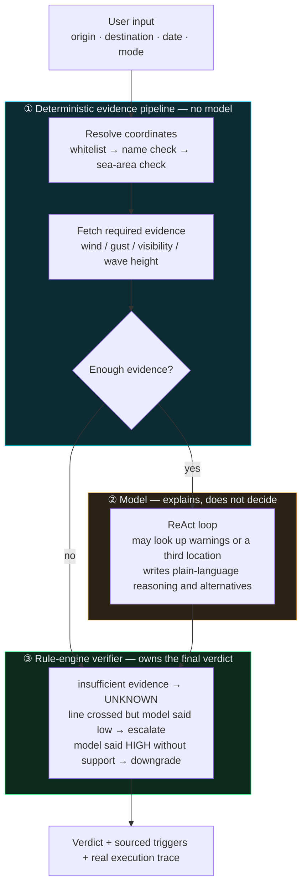

<p align="center">
  
</p>

<p align="center">
  <a href="https://voyageguard-two.vercel.app"><strong>Live demo</strong></a> &middot;
  <a href="#how-to-use"><strong>How to use</strong></a> &middot;
  <a href="#architecture"><strong>Architecture</strong></a> &middot;
  <a href="#evaluation"><strong>Evaluation</strong></a> &middot;
  <a href="#documentation"><strong>Docs</strong></a> &middot;
  <a href="README.md"><strong>中文</strong></a>
</p>

<p align="center">
  <a href="https://voyageguard-two.vercel.app"></a>
  
  <a href="evals/l3_sufficiency.py"></a>
  <a href="evals/golden/events.jsonl"></a>
  
  <a href="LICENSE"></a>
</p>

# VoyageGuard · Weather-Risk Decision Agent

**You've booked a flight or a ferry, and a gale is coming. Do you still go?**

VoyageGuard checks live weather data against officially published warning and navigation-ban thresholds, and tells you
**whether any official line has been crossed today** — citing the source for each one. When the evidence isn't there,
it says so ("insufficient evidence") instead of guessing. Flights and ferries, Chinese and English UI.

|  |  |
|---|---|
| **Problem** | Airline apps only report flights already cancelled, weather apps give raw numbers, official notices are late and scattered. Nobody tells you whether a number crosses a line |
| **Approach** | Code fetches the required evidence first → the model explains and advises → a rule engine outside the model loop makes the final call |
| **Output** | A risk level plus sourced triggers (regulation / official warning / this tool's judgement); a fourth verdict, `UNKNOWN`, when evidence is insufficient |
| **Shape** | An agent: in a ReAct loop the model decides whether and which supplementary tool to call (2 tools, up to 5 rounds) — but fenced in: required evidence is fetched by code first, and the verdict is made outside the loop. Terminology follows Anthropic's [*Building effective agents*](https://www.anthropic.com/engineering/building-effective-agents) |
| **Evaluation** | Four layers: L1 39 cases across 4 models · L2 real network + 3 fault injections · L3 187 zero-token checks · L4 25 real suspension / normal-service records |

<p align="center">
  
  <br><sub>Live result in the English UI (Yantai → Dalian by ferry, forecast for 2026-09-30): verdict and four sourced triggers on the left, alternatives and the real execution trace on the right. The route-midpoint label (航线中点) is not translated yet</sub>
</p>

## Contents

- [How to use](#how-to-use)
- [The problem](#the-problem)
- [Requirements: decide what the product may say](#requirements-decide-what-the-product-may-say)
- [Architecture](#architecture)
- [What's inside](#whats-inside)
- [Key design decisions](#key-design-decisions)
- [Evaluation](#evaluation) · [Results](#results)
- [Known limits](#known-limits)
- [Quick start](#quick-start)
- [Documentation](#documentation)
- [Other projects by the author](#other-projects-by-the-author)

## How to use

Open **[voyageguard-two.vercel.app](https://voyageguard-two.vercel.app)** — no sign-in. Switch the UI to English with the **EN** button in the top-right corner.

|        | Step | Notes |
| ------ | --- | --- |
| **01** | Enter origin and destination | Or pick one of the three presets under "Quick demo" |
| **02** | Choose date and mode | Today plus two days. For ferries, pick a vessel type — "not sure" applies the stricter small-craft standard |
| **03** | Read the verdict | Risk level + which official lines were crossed (sources are clickable); expand "Agent Execution Trace" to see every real call |

Inputs worth trying:

| Input | What you'll see |
|---|---|
| `Yantai → Dalian`, ferry | A **route midpoint** in the evidence — sampling only the ports would miss real suspensions |
| `Beijing → Xi'an`, **ferry** | **Insufficient evidence**, and **no travel recommendation** — the core claim of this project |
| `Shanghai → Antarctica`, flight | An abstention, not "low risk, go ahead" |
| Expand the **Agent Execution Trace** | Real tool names, arguments and latency; deterministic prefetch and model-initiated calls are labelled separately |

The top-right corner also links back to this repository.

## The problem

Deciding whether to travel in a gale means stitching the answer together yourself, and each channel is missing a piece:

| Channel | What's missing |
|---|---|
| Airline / ferry apps | They only tell you what has **already** been cancelled. No help a day ahead |
| Weather apps | They say "wind 14 m/s", but not what that number **means** |
| Official notices | Authoritative, but late, and scattered across local maritime bureaus and airline accounts |

**The missing layer is translating weather numbers into "has an official line been crossed?"** That layer isn't hard to
build; the hard part is making it hold up. It's safety-related, and the costs are asymmetric: failing to warn is far worse than warning once too often.

## Requirements: decide what the product may say

Before building, one question: **is this product entitled to answer "will this ferry be suspended?"**

No. The Ministry of Transport's [reply to an NPC proposal](https://xxgk.mot.gov.cn/jigou/haishi/202006/t20200630_3319352.html)
states that a vessel's wind resistance is calculated from **wind pressure** and does **not** map onto the Beaufort scale —
which is why officials **deliberately don't print a wind rating on ship certificates**. The real decision chain is:
each vessel's stability limits → the operator's judgement → the maritime authority may order a halt → local blanket rules on top.

**So the product says exactly one thing: has an officially published warning or navigation-ban line been crossed today?**
Whether the service actually runs is the carrier's and the authority's call.

That single decision drives three designs:

| Position | Design consequence |
|---|---|
| State crossings, don't predict suspensions | The output is a **list of sourced triggers**, each marked as regulation or warning standard; medium / high verdicts always end with "follow official notices" |
| Whether a line is crossed is a fact, not an opinion | **The verdict belongs to the rule engine**, not the model |
| No basis, no verdict | A fourth verdict, **`UNKNOWN` (insufficient evidence)** — also decided outside the model |

The third one shows the difference best — "insufficient evidence" isn't a disclaimer, it's **a different kind of output**:

<p align="center">
  
  <br><sub><code>Beijing → Xi'an</code> by ferry: no risk level, no "go" badge; <code>abstention_gate</code> in the trace shows the model was never called</sub>
</p>

**Deciding what AI should and shouldn't do is the central product decision here.**

## Architecture



| | Who does it | Who decides |
|---|---|---|
| Evidence the safety verdict depends on | `evidence.py`, deterministic prefetch | Not the model |
| Explanation, advice, weighing multiple factors | The model | Model's discretion |
| Final risk level and trigger list | `rules.py`, rule engine | Not the model |

**Core principle: fetching safety-critical evidence and judging red lines never depend on the model's discretion.**
These boundaries are enforced in code, not by prompt. Details in [docs/architecture.md](docs/architecture.md) (Chinese).

## What's inside

**Only what's actually there.** Every row points to code.

| Capability | In this project | Where |
|---|---|---|
| Agent loop / ReAct | The model can call tools over several rounds for supplementary evidence, capped at 5 | `agent.py` |
| Tool use | OpenAI-compatible function calling, 2 supplementary-evidence tools | `agent.TOOLS` |
| **Evidence prefetch & structured injection** | Data the verdict depends on is fetched **before** the model runs and injected as structured JSON | `evidence.py` → `build_user_message` |
| **Rule-engine verifier** | Sits **outside** the model loop and owns the final verdict | `rules.py` |
| **Abstention** | A fourth state, `UNKNOWN`, also decided by the rule engine | `rules.evaluate` |
| Observability / provenance | Every value carries `source` + `fetched_at`; the UI shows the real execution trace | `evidence.TraceStep` |
| Graceful degradation | Model down / timeout / unparseable output → `rule_only` verdict | `agent` + `rules` |
| Model-agnostic harness | 4 providers switched by env var, chosen by the L1 bake-off | `providers.py` |
| Structured output contract | JSON schema plus a fallback path when parsing fails | `parse_agent_output` |
| **Eval as a product function** | Four layers; L4 uses real-world labels rather than annotation | `evals/` |

> The four bold rows are the point; the rest is standard. "Evidence prefetch & structured injection" is deliberately
> not called context engineering — that term usually means memory, compaction and context-window management, none of which are here.

**Deliberately left out, and why**

| Not built | Why |
|---|---|
| Memory / compaction | A single-turn decision query: fill the form, get a verdict. No long-running task, no state across turns |
| Multi-agent / subagents | The task is "fetch two or three data points → compare to thresholds → decide". Splitting it only adds coordination overhead and failure modes |
| RAG | The criteria are a few hundred characters and fit in the system prompt. Vector retrieval at this size is a net loss |
| MCP / skills | Two tools, both in-process; no cross-process or third-party tool ecosystem to connect |
| Multi-step planning | The flow is a fixed three stages; the model doesn't need to plan its own path |
| SSE streaming | Nicer demo, but it needs an extra adaptation layer on serverless and proxy buffering could stall the live demo |
| Fine-tuning / RL | The criteria are hard thresholds; they belong in the rule engine, not in the weights |

**This project's answer to "where should AI be used?" is: as little as possible in the safety-critical verdict.**

## Key design decisions

| Decision | One-line reason |
|---|---|
| **Required evidence isn't left to the model** | Models are unreliable at abstaining: here they missed 21 of 24 chances when data was missing |
| **The rule engine owns the verdict** | Crossing a line is a fact: crossed but judged low → escalate; judged high without support → downgrade |
| **Block queries whose premise is false** | Missing an airport only causes an abstention; admitting a nonexistent one yields "go ahead" — the errors aren't symmetric |
| **Coverage is part of product quality** | Official data first; fall back and label it when unavailable, instead of refusing to answer |

<details>
<summary><b>Show the reasoning behind each decision</b></summary>

<br>

**1. Required evidence isn't left to the model.** The model may call tools, but wind, visibility and wave height are fetched before the model runs.
The basis is AgentAbstain ([arXiv 2607.10059](https://arxiv.org/abs/2607.10059)): the strongest model scores only **59.5%** on paired abstention tasks,
and abstention ability is largely unrelated to general capability — a stronger model won't fix it. This project's evaluation
[reproduces that result](docs/evaluation.md#弃权是模型最不可靠的能力).

**2. The rule engine owns the verdict.** It sits outside the model loop and does three things: insufficient evidence → `UNKNOWN`;
a hard line crossed while the model said low → escalate; the model said HIGH without structured support → downgrade.
Which path was taken is exposed in the `decision_source` field.

**3. Block queries whose premise is false.** Worse than a wrong risk level is a confident answer to a question that doesn't make sense.
Flights use an airport whitelist — the aviation criteria only need wind and visibility, which exist for any place name, so without it
"Shanghai → Antarctica" would come back "low risk, go ahead". Place names pass two checks — geocoding is fuzzy: searching `Xian`
returns `Xián (Spain) / Xianning / Xianyang / Zhuhai` and not Xi'an at all, so a candidate must match the input before the sea-area check.

**4. Coverage is part of product quality.** 38 airports publish official METAR/TAF; the rest don't. That doesn't mean refusing to answer —
of the aviation criteria, only visibility truly needs runway observations; gale warnings are issued for regions, and city surface wind is their input.
So data sources are tiered: official first, fall back when unavailable, and say which one was used.

</details>

## Evaluation

**Treated as a product function, not as testing.**

| Layer | What it measures | What it isolates | Cost |
|---|---|---|---|
| **L1 reasoning** | LLM judgement on given data (39 cases × 4 models) | Network, data sources, real-world drift | Tokens |
| **L2 integration** | Whether end-to-end verdicts hold and are self-consistent, incl. 3 fault injections | Nothing — it's meant to be real | Tokens + network |
| **L3 data sufficiency** | Whether the data that should be there actually is (187 deterministic checks) | No LLM at all | **Zero tokens** |
| **L4 real-world backtest** | **Whether the thresholds match whether services actually stopped** (25 records) | No LLM at all | **Zero tokens** |

<details>
<summary><b>Why one layer isn't enough</b></summary>

<br>

- L1 mocks all tools, which cleanly isolates reasoning but **hides holes in the data pipeline** — mock data always happens to fit the parser.
  **L3 covers that at zero token cost** and runs without any API key
- Pipeline errors have an objective state (fetched / not fetched) that tests can catch; **knowledge-base errors are silent** — get a threshold
  wrong and every test still passes, because the expected values were written from that same threshold. **L4 checks thresholds against real outcomes**
  and is the only layer that can reveal gaps in the thresholds themselves
- **L4 labels need no expert judgement** — whether a service actually ran that day is a published, objective fact

</details>

Full design and check list in [docs/evaluation.md](docs/evaluation.md) (Chinese).

### Results

> The evaluation scripts print to the terminal and don't archive results; every number below can be reproduced with the commands
> in [Quick start](#quick-start). L1 numbers come from a run on 2026-09-01; L4 uses no LLM and a re-run on 2026-09-26 matched exactly.

**L4: thresholds checked against 25 real suspension / normal-service records** (wind reconstructed from the ERA5 archive, waves from Open-Meteo Marine historical data)

<p align="center"></p>

- **0% false alarms** (none of the 10 normal-service days was judged HIGH) — it never cried wolf on a day the service ran normally
- **The recall gap is the most useful output**: 7 of the 9 misses are typhoon-related, which points to **a whole missing axis — typhoon warnings**.
  Carriers suspend service ahead of typhoon warnings, a separate official signal from wind and wave thresholds. The gap is recorded rather than patched with an unsourced threshold

**L1: four-model bake-off**

<p align="center"></p>

Raw accuracy ranges from **56.4% to 89.7%**; with the safety net, **every model reaches 100%**. The finer the criteria, the easier it is for a model
to slip one level — and the more a deterministic verifier is worth. It puts a 56% model and a 90% model on the same line.

**The number worth remembering: 87.5%.** In 6 cases with missing evidence, the system prompt explicitly said "better to say you don't know than to guess",
and the relevant JSON fields were plainly `null`. Across four models there were 24 chances to abstain; **21 were missed, and all 21 were judged `LOW`**.
All 4 of deepseek's errors and all 5 of kimi's were abstention cases — on the 33 cases with data, they made none.
**All 24 ended up correct, because the abstention decision was never given to the model.**

## Known limits

For a safety-related tool, stating what it **can't** judge matters as much:

- **Typhoon warnings aren't modelled** — the biggest gap L4 found; recorded rather than patched with an unsourced threshold
- **Inland rivers and lakes aren't covered** — inland navigation has its own official standard (wind bands, no wave height), incompatible with the maritime criteria
- **Routes aren't verified to exist** — only that each end is a real port or airport, not that a service runs between them
- **Three `PROD` rules aren't regulations** — small craft in a blue wave warning, 15 m/s for flights, thunderstorms for flights; each is labelled with its reasoning
- **Two sources are second-hand** (one news report, one manufacturer figure) — labelled as such rather than presented as official
- **ERA5 is a reanalysis, not a forecast** — L4 validates whether the thresholds are right, not whether forecasts are good enough

Full list in [docs/limitations.md](docs/limitations.md) (Chinese).

## Quick start

```bash
pip install -r requirements.txt
echo "DASHSCOPE_API_KEY=your_key_here" > .env
uvicorn app:app --reload          # then open http://localhost:8000
```

Four model providers are supported, switched with `VOYAGEGUARD_PROVIDER` (`qwen` / `deepseek` / `kimi` / `glm`); each model id can be
overridden with `VOYAGEGUARD_MODEL_<PROVIDER>` without code changes.

**Don't take the numbers on trust — run them:**

```bash
python -m evals.l3_sufficiency    # ~2 minutes, zero tokens, no API key, 187 deterministic checks
python -m evals.run_all           # L3 → L2 (real network + real models, 3 fault injections) → L4 (real-world records)
```

<details>
<summary><b>Deployment and stack</b></summary>

<br>

**Deployment**: Vercel's Python framework preset picks up the top-level `app` in `app.py` as the ASGI entry point — no `api/` directory needed.
Pushing to GitHub deploys automatically; environment variables live in the Vercel project settings. The `Dockerfile` is kept for self-hosting (port 7860).

**Stack**: FastAPI · OpenAI-compatible SDK (Qwen / DeepSeek / Kimi / GLM) · aviationweather.gov (METAR / TAF / SIGMET) ·
wttr.in · Open-Meteo Marine / Geocoding / ERA5 · DDGS · single-file frontend (no build step) · Vercel

</details>

## Documentation

The detailed documents are in Chinese.

| Document | Contents |
|---|---|
| **[Architecture](docs/architecture.md)** | Evidence tiers, decision provenance, all abstention triggers, the rule engine, reachability contract, two-step place-name resolution, route modelling |
| **[Knowledge base](docs/knowledge-base.md)** | Every safety threshold and its source (generated from code), `REG` / `WARN` / `PROD` classes, source strength |
| **[Evaluation design & full results](docs/evaluation.md)** | What each of the four layers measures, the check list, all L4 and L1 numbers |
| **[Known limits](docs/limitations.md)** | Capability limits / criteria limits / evaluation-method limits / engineering trade-offs |

## Other projects by the author

Each project's shape follows its task: a fenced-in agent for a single-turn decision, a multi-agent workflow for critique from several sides, a scheduled workflow for a fixed daily run.

| Project | Shape | What it is |
| --- | --- | --- |
| **VoyageGuard** (this repo) | Single agent + rule engine outside the loop | Weather-risk decision agent · [live](https://voyageguard-two.vercel.app) |
| [**Liangyi**](https://github.com/wenboxia/liangyi) | Multi-agent workflow | Cross-vendor multi-agent workflow for refining product ideas · [live](https://liangyi-five.vercel.app). Its retrospective case study replays this project's real development history |
| [**AIRadar**](https://github.com/wenboxia/airadar) | Scheduled workflow | A daily AI-industry intelligence workflow · [live](https://wenboxia.github.io/airadar/) |

## Author

Wenbo Xia (夏文博) · AI product manager · [MIT License](LICENSE)
