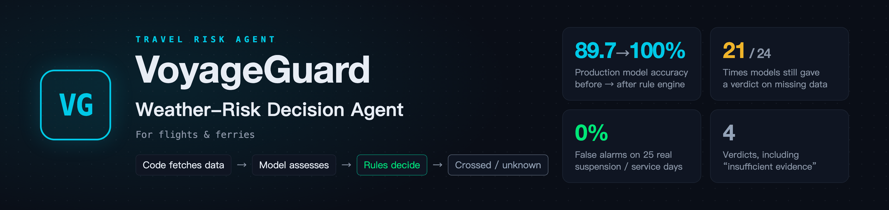
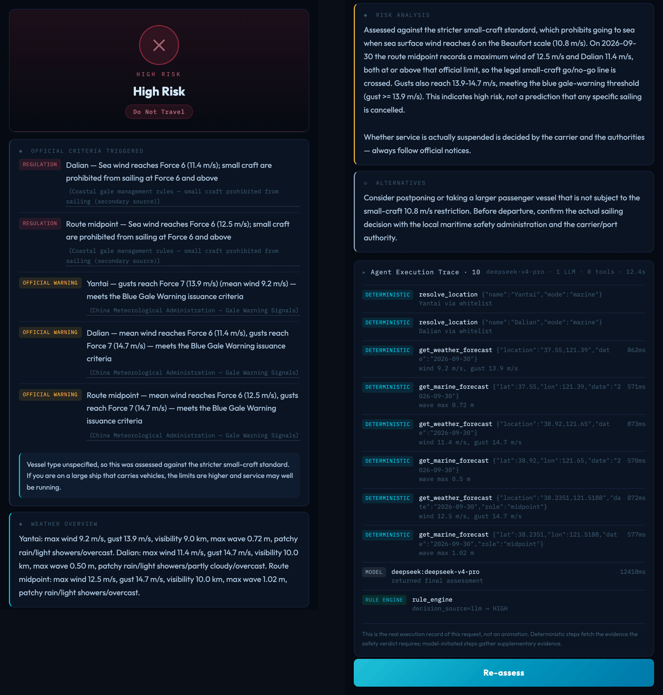
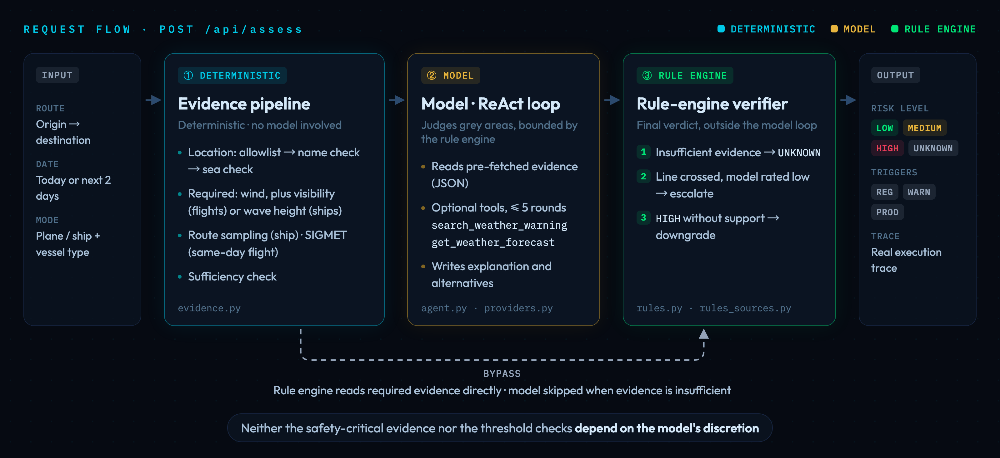
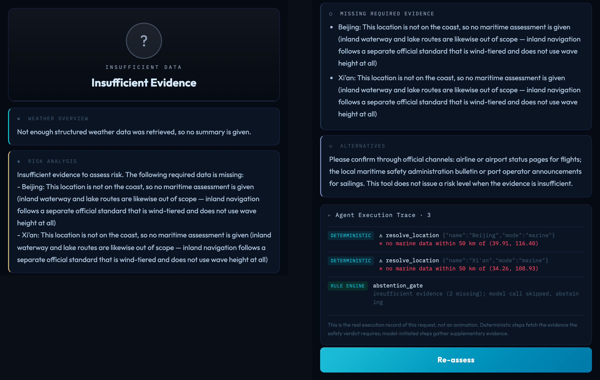

<p align="center">
  
</p>

<p align="center">
  <a href="#live-demo"><strong>Live demo</strong></a> &middot;
  <a href="#architecture"><strong>Architecture</strong></a> &middot;
  <a href="#core-mechanisms"><strong>Core mechanisms</strong></a> &middot;
  <a href="#evaluation"><strong>Evaluation</strong></a> &middot;
  <a href="#quick-start"><strong>Quick start</strong></a> &middot;
  <a href="README.md"><strong>中文</strong></a>
</p>

<p align="center">
  <a href="https://voyageguard-two.vercel.app"></a>
  
  <a href="evals/l3_sufficiency.py"></a>
  <a href="evals/golden/events.jsonl"></a>
  
  <a href="LICENSE"></a>
</p>

# VoyageGuard · Weather-Risk Decision Agent

**You've booked a flight or a ferry, and a gale is coming. Do you still go?**

<table>
  <tr><td width="96"><b>Use case</b></td><td>Before travelling in strong winds, assess the weather risk for a flight or a ship</td></tr>
  <tr><td width="96"><b>Input</b></td><td>Origin, destination, a date from today up to two days ahead, plane or ship</td></tr>
  <tr><td width="96"><b>Output</b></td><td>A risk level plus the official thresholds crossed, with sources; <code>UNKNOWN</code> when required evidence is missing</td></tr>
  <tr><td width="96"><b>Out of scope</b></td><td>Predicting suspensions, which is decided by the carrier and the authorities (basis: <a href="https://xxgk.mot.gov.cn/jigou/haishi/202006/t20200630_3319352.html">Ministry of Transport reply</a>)</td></tr>
</table>

<p align="center">
  
  <br><sub>A real run (Yantai → Dalian by ship, forecast for 2026-09-30): verdict and five sourced triggers on the left; risk analysis, alternatives and execution trace on the right</sub>
</p>

## Live demo

Open **[voyageguard-two.vercel.app](https://voyageguard-two.vercel.app)** (no sign-in). Example inputs:

| Input | Result |
|---|---|
| `Yantai → Dalian` by ship | Samples the **route midpoint** as well as both ports |
| `Beijing → Xi'an` by ship | Neither end is coastal → `UNKNOWN` |
| `Shanghai → Antarctica` by plane | Antarctica is not on the airport list → `UNKNOWN` |

## Architecture

Each request passes through three stages:

<p align="center">
  
</p>

<p align="center">
  
  <br><sub>Beijing → Xi'an by ship: the trace stops at <code>abstention_gate</code>; the model is not called</sub>
</p>

## Core mechanisms

| Mechanism | How | Code |
|---|---|---|
| **Required evidence pre-fetched by code** | Wind, visibility and wave height needed for the verdict are fetched before the model runs and injected as JSON | [`evidence.py`](evidence.py) |
| **ReAct for supplementary evidence** | The model calls warning search and third-location weather as needed, up to 5 rounds; supplementary evidence never reaches the rule engine | [`agent.py`](agent.py) |
| **Rule engine decides** | Threshold crossed but the model rated it low → escalate; model says `HIGH` without supporting data → downgrade; model times out or fails → the rule engine decides alone | [`rules.py`](rules.py) |
| **Abstain on missing evidence** | Missing required evidence → `UNKNOWN`, model not called | [`app.py`](app.py) · [`rules.py`](rules.py) |
| **Sourced triggers** | Labelled by source type: `REG` regulation / `WARN` official warning / `PROD` product rule | [`rules_sources.py`](rules_sources.py) |
| **Premise checks** | Airport list for flights; for ports, the geocoded name must match the input, then the location is checked against marine data | [`evidence.py`](evidence.py) |
| **Route sampling** | One point roughly every 200 km along a ship route, up to 5 | [`evidence.py`](evidence.py) |

## Evaluation

| Layer | What it tests | Size | Result |
|---|---|---|---|
| **L1 Reasoning** | The model's judgement on given data | 39 cases × 4 models | See table below |
| **L2 Integration** | End-to-end verdicts with real network and models, including 3 fault injections | 10 scenarios | All passed |
| **L3 Data sufficiency** | Whether required data was obtained (zero tokens) | 190 checks | All passed |
| **L4 Real-world back-test** | Whether thresholds match real suspensions / normal service (zero tokens) | 25 records | 0% false alarms; 9 misses |

| L1 model | Model alone | After rule engine | Abstained when data was missing |
|---|---|---|---|
| **deepseek-v4-pro** (production) | 89.7% | **100%** | 2 / 6 |
| kimi-k3 | 87.2% | **100%** | 1 / 6 |
| glm-5 | 71.8% | **100%** | 0 / 6 |
| qwen-plus | 56.4% | **100%** | 0 / 6 |

<sub>Every case the models failed to abstain on was rated <code>LOW</code>; the rule engine abstained instead · L1 run on 2026-09-01, L2 / L3 run on 2026-09-29 (scripts do not save results) · full figures in <a href="docs/evaluation.md">docs/evaluation.md</a></sub>

## Known limitations

| Limitation | Details |
|---|---|
| Typhoon warnings not modelled | 7 of the 9 L4 misses are typhoon-related |
| Inland rivers and lakes not covered | A separate official standard applies that does not carry over to maritime criteria |
| Route existence not verified | Only checks that each end can be assessed (an airport on the list, a coastal port) |
| Three `PROD` rules are product decisions | Small craft under a blue sea-wave warning; aviation mean wind ≥ 15 m/s; aviation thunderstorms |

## Quick start

```bash
pip install -r requirements.txt
echo "DASHSCOPE_API_KEY=your_key_here" > .env   # Qwen by default; set VOYAGEGUARD_PROVIDER and its key to switch
uvicorn app:app --reload                         # open http://localhost:8000
python -m evals.l3_sufficiency                   # deterministic checks, no API key needed
```

## Documentation

The detailed documents are in Chinese.

| Document | Contents |
|---|---|
| [Architecture](docs/architecture.md) | Evidence tiers, abstention triggers, rule engine, place-name resolution, route modelling |
| [Knowledge base](docs/knowledge-base.md) | Every threshold and its source (generated from code) |
| [Evaluation](docs/evaluation.md) | Four-layer design, list of checks, full figures and charts |
| [Known limitations](docs/limitations.md) | Capability limits, criteria limits, evaluation-method limits, engineering trade-offs |

## Related projects

| Project | Description |
|---|---|
| [**Liangyi**](https://github.com/wenboxia/liangyi) | Cross-vendor multi-agent workflow for refining product ideas · [Live demo](https://liangyi-five.vercel.app) |
| [**AIRadar**](https://github.com/wenboxia/airadar) | Daily scheduled AI industry intelligence workflow · [View](https://wenboxia.github.io/airadar/) |

## Author

Wenbo Xia · AI Product Manager · [MIT License](LICENSE)
