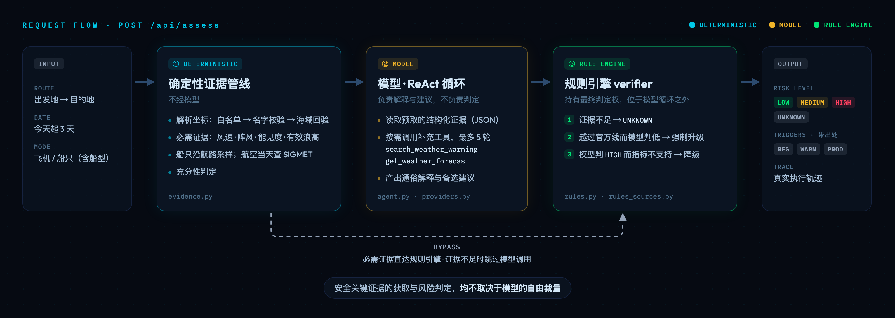

<p align="center">
  
</p>

<p align="center">
  <a href="#在线体验"><strong>在线体验</strong></a> &middot;
  <a href="#架构"><strong>架构</strong></a> &middot;
  <a href="#核心机制"><strong>核心机制</strong></a> &middot;
  <a href="#评测"><strong>评测</strong></a> &middot;
  <a href="#快速上手"><strong>快速上手</strong></a> &middot;
  <a href="README.en.md"><strong>English</strong></a>
</p>

<p align="center">
  <a href="https://voyageguard-two.vercel.app"></a>
  
  <a href="evals/l3_sufficiency.py"></a>
  <a href="evals/golden/events.jsonl"></a>
  
  <a href="LICENSE"></a>
</p>

# VoyageGuard · 出行气象决策 Agent

**订了船票机票，遇上大风天，到底还走不走？**

<table>
  <tr><td width="64"><b>场&#8288;景</b></td><td>大风天出行前，判断航班或船班的气象风险</td></tr>
  <tr><td width="64"><b>输&#8288;入</b></td><td>出发地、目的地、日期（今天起 3 天）、飞机或船只</td></tr>
  <tr><td width="64"><b>输&#8288;出</b></td><td>风险等级 + 越过的官方判定线及出处；必需证据不足时输出 <code>UNKNOWN</code></td></tr>
  <tr><td width="64"><b>不&#8288;做</b></td><td>不预测是否停航，由承运人与主管部门决定（依据：<a href="https://xxgk.mot.gov.cn/jigou/haishi/202006/t20200630_3319352.html">交通运输部答复函</a>）</td></tr>
</table>

<p align="center">
  
  <br><sub>真实运行结果（烟台 → 大连，船只，2026-09-30 预报）：左栏为结论与 5 条带出处的触发项，右栏为风险分析、备选建议与执行轨迹</sub>
</p>

## 在线体验

打开 **[voyageguard-two.vercel.app](https://voyageguard-two.vercel.app)**（无需登录），示例输入：

| 输入 | 结果 |
|---|---|
| `烟台 → 大连` 船只 | 除两端港口外，还采样**航线中点** |
| `北京 → 西安` 船只 | 两端不临海 → `UNKNOWN` |
| `上海 → 南极` 飞机 | 南极不在机场清单 → `UNKNOWN` |

## 架构

每个请求经过三段处理：

<p align="center">
  
</p>

<p align="center">
  
  <br><sub>北京 → 西安（船只）：执行轨迹止于 <code>abstention_gate</code>，未调用模型</sub>
</p>

## 核心机制

| 机制 | 做法 | 代码 |
|---|---|---|
| **必需证据由代码预取** | 调用模型前取好判定所需的风速、能见度、浪高，以 JSON 注入 | [`evidence.py`](evidence.py) |
| **ReAct 补充证据** | 模型按需调用预警搜索、第三地天气，最多 5 轮；补充证据不进规则引擎 | [`agent.py`](agent.py) |
| **规则引擎判定** | 越线而模型判低 → 升级；模型判 `HIGH` 而指标不支持 → 降级；模型超时或出错 → 单独出结论 | [`rules.py`](rules.py) |
| **证据不足即弃权** | 缺必需证据 → `UNKNOWN`，不调用模型 | [`app.py`](app.py) · [`rules.py`](rules.py) |
| **触发项附出处** | 按来源类型标注：`REG` 法规 / `WARN` 官方预警 / `PROD` 产品规则 | [`rules_sources.py`](rules_sources.py) |
| **前提校验** | 航空查机场清单；地名先核对名字，再做海域回验 | [`evidence.py`](evidence.py) |
| **沿航路采样** | 船舶航线每约 200 km 取一个点，最多 5 个 | [`evidence.py`](evidence.py) |

## 评测

| 层 | 测什么 | 规模 | 结果 |
|---|---|---|---|
| **L1 推理** | 给定数据下模型的判断 | 39 条用例 × 4 家模型 | 见下表 |
| **L2 集成** | 真实网络与模型的端到端结论，含 3 组故障注入 | 10 组场景 | 全部通过 |
| **L3 数据充分性** | 必需数据是否取到（零 token） | 190 条断言 | 全部通过 |
| **L4 真实回验** | 阈值与真实停航 / 通航是否吻合（零 token） | 25 条记录 | 误报率 0%；漏判 9 条 |

| L1 模型 | 模型自己判 | 经规则引擎后 | 缺数据时主动弃权 |
|---|---|---|---|
| **deepseek-v4-pro**（生产） | 89.7% | **100%** | 2 / 6 |
| kimi-k3 | 87.2% | **100%** | 1 / 6 |
| glm-5 | 71.8% | **100%** | 0 / 6 |
| qwen-plus | 56.4% | **100%** | 0 / 6 |

<sub>未弃权的全部判 <code>LOW</code>，最终由规则引擎弃权 · L1 为 2026-09-01 运行结果，L2 / L3 为 2026-09-29 实跑（评测脚本不落盘）· 完整数据见 <a href="docs/evaluation.md">docs/evaluation.md</a></sub>

## 已知边界

| 边界 | 说明 |
|---|---|
| 台风预警未建模 | L4 的 9 条漏判中 7 条与台风相关 |
| 内河与湖泊不覆盖 | 适用另一套官方标准，与海事判据不通用 |
| 不核实航线是否存在 | 只校验两端各自可评估（机场在清单内、港口临海） |
| 三条 `PROD` 规则为产品决策 | 小船遇海浪蓝色预警、航空平均风 ≥ 15 m/s、航空雷暴 |

## 快速上手

```bash
pip install -r requirements.txt
echo "DASHSCOPE_API_KEY=your_key_here" > .env   # 默认 Qwen；换模型设 VOYAGEGUARD_PROVIDER 及对应 Key
uvicorn app:app --reload                         # 打开 http://localhost:8000
python -m evals.l3_sufficiency                   # 确定性断言，无需 API Key
```

## 文档

| 文档 | 内容 |
|---|---|
| [架构细节](docs/architecture.md) | 证据分层、弃权触发条件、规则引擎、地名解析、航路建模 |
| [知识库](docs/knowledge-base.md) | 全部阈值与出处（由代码生成） |
| [评测](docs/evaluation.md) | 四层设计、断言清单、完整数字与图表 |
| [已知边界](docs/limitations.md) | 能力边界、判据局限、评测方法局限、工程取舍 |
