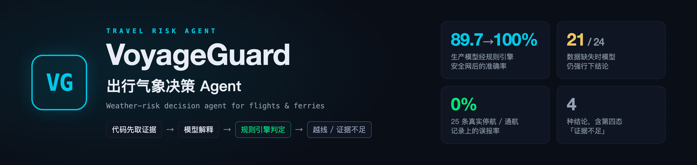
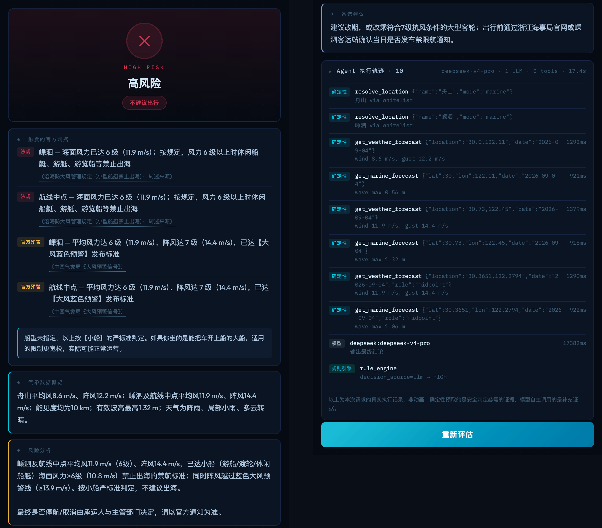
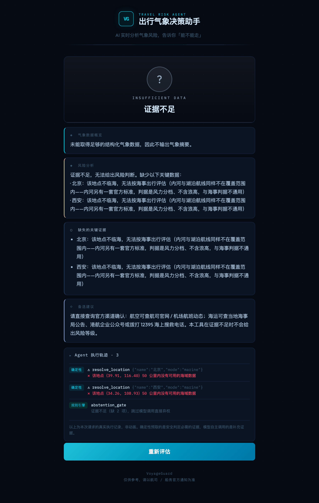
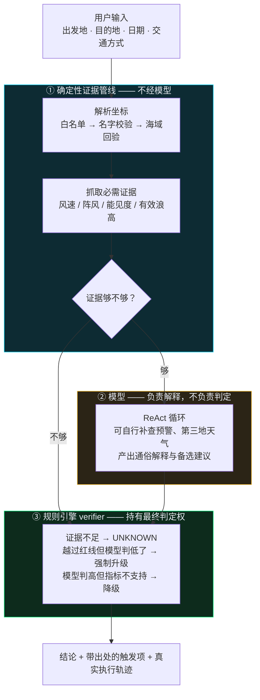
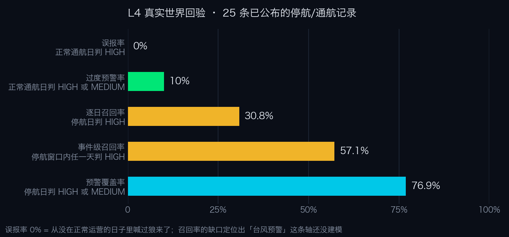
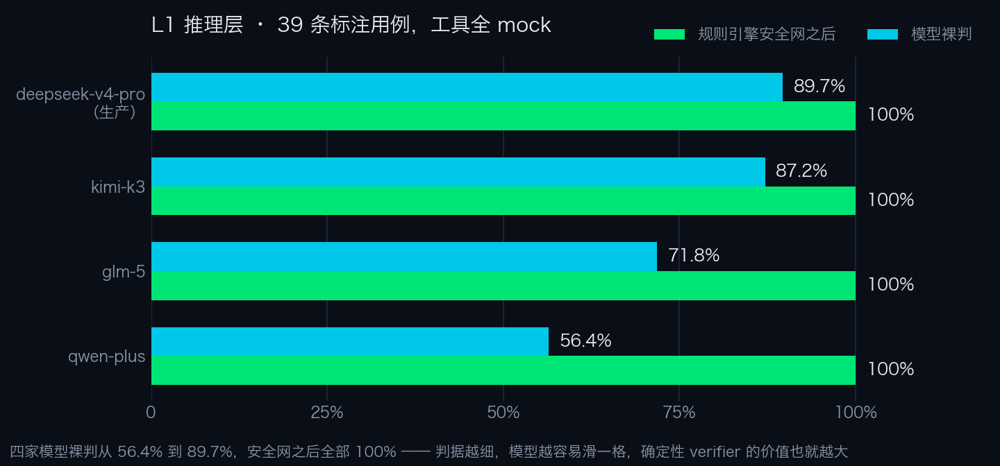

<p align="center">
  
</p>

<p align="center">
  <a href="https://voyageguard-two.vercel.app"><strong>在线体验</strong></a> &middot;
  <a href="#怎么用"><strong>怎么用</strong></a> &middot;
  <a href="#架构"><strong>架构</strong></a> &middot;
  <a href="#评测"><strong>评测</strong></a> &middot;
  <a href="#详细文档"><strong>文档</strong></a> &middot;
  <a href="README.en.md"><strong>English</strong></a>
</p>

<p align="center">
  <a href="https://voyageguard-two.vercel.app"></a>
  
  <a href="evals/l3_sufficiency.py"></a>
  <a href="evals/golden/events.jsonl"></a>
  
  <a href="LICENSE"></a>
</p>

# VoyageGuard · 出行气象决策 Agent

**订了船票机票，遇上大风天，到底还走不走？**

把实时气象数据和官方发布的预警、禁航标准自动比对，告诉你**今天有没有越过某条官方的线**，
每一条都点名出处；证据不够时明说「证据不足」，不硬给结论。飞机与船只两种场景，中英双语。

|  |  |
|---|---|
| **问题** | 航司 App 只报已经取消的航班，天气 App 只给数字，官方公告滞后又分散——缺一层「这个数字越没越线」 |
| **做法** | 代码先取必需证据 → 模型负责解释和建议 → 规则引擎在模型循环之外做最终判定 |
| **输出** | 风险等级 + 带出处的触发项（法规 / 官方预警 / 本工具判定）；证据不足时输出第四种结论 `UNKNOWN` |
| **形态** | Agent：ReAct 循环里模型自己决定调不调、调哪个补充工具（2 个工具，上限 5 轮）；但被围起来——必需证据由代码先取，判定在循环外。分法参照 Anthropic [*Building effective agents*](https://www.anthropic.com/engineering/building-effective-agents) |
| **评测** | 四层：L1 39 条用例横评 4 家模型 · L2 真实网络 + 3 组故障注入 · L3 187 条零 token 断言 · L4 25 条真实停航 / 通航记录 |

<p align="center">
  
  <br><sub>线上真实结果（舟山 → 嵊泗，船只）：左栏是结论和 4 条带出处的触发项（含航线中点），右栏是备选建议和真实执行轨迹</sub>
</p>

## 目录

- [怎么用](#怎么用)
- [它解决什么问题](#它解决什么问题)
- [需求分析：先划清能说什么](#需求分析先划清能说什么)
- [架构](#架构)
- [技术构成](#技术构成)
- [关键设计决策](#关键设计决策)
- [评测](#评测) · [结果](#结果)
- [已知边界](#已知边界)
- [快速上手](#快速上手)
- [详细文档](#详细文档)
- [同作者的其他项目](#同作者的其他项目)

## 怎么用

打开 **[voyageguard-two.vercel.app](https://voyageguard-two.vercel.app)**，不用登录：

|        | 步骤 | 说明 |
| ------ | --- | --- |
| **01** | 填出发地和目的地 | 或者点「快速体验」里的三个预设 |
| **02** | 选日期和交通方式 | 今天起 3 天。选船只时再选船型，不确定就按小船的严标准算 |
| **03** | 看结论 | 风险等级 + 触发了哪条官方线（出处可点）；展开「Agent 执行轨迹」看每一步真实调用 |

几个值得试的输入：

| 输入 | 会看到什么 |
|---|---|
| `烟台 → 大连` 船只 | 证据里有**航线中点**——只采港口会漏判真实停航 |
| `北京 → 西安` **船只** | **证据不足**，且**不显示出行建议**——这是本项目的核心主张 |
| `上海 → 南极` 飞机 | 弃权，而不是「低风险，建议出行」 |
| 展开 **Agent 执行轨迹** | 真实工具名、参数、耗时；确定性预取与模型自主调用分开标 |

右上角可以切中英文（只在填表页），也可以回到本仓库。

## 它解决什么问题

大风天要不要出发，普通人现在只能自己拼凑答案，而三个渠道各差一块：

| 渠道 | 差在哪 |
|---|---|
| 航司 / 船务 App | 只告诉你**已经**取消的航班。想提前一天判断，它帮不上忙 |
| 天气 App | 告诉你「风速 14 m/s」，但不告诉你这个数字**意味着什么** |
| 官方公告 | 权威，但发布滞后，而且分散在各地海事局、航司公众号里 |

**缺的是中间那一层：把气象数字翻译成「有没有越过官方的线」。**
这一层不难做，难的是**做得住**——它是安全相关的，说错话的代价不对称：该提醒时没提醒，比多提醒一次严重得多。

## 需求分析：先划清能说什么

做之前先查了一个关键问题：**「这条船会不会停航」，我有资格回答吗？**

答案是没有。[交通运输部对人大建议的答复函](https://xxgk.mot.gov.cn/jigou/haishi/202006/t20200630_3319352.html)
写得很清楚：船舶抗风能力按**风压**计算，与蒲福风级**不是对应关系**，所以官方**故意不在船舶证书上标注抗风等级**。
真实的决策链是：每条船有自己的稳性限制 → 船公司判断 → 海事部门可下令 → 地方另有一刀切规定。

**所以这个产品只说一件事：今天有没有越过某条官方发布预警或禁航的线。** 至于会不会停航，那是承运人和主管部门的决定。

这一条判断直接决定了三个设计：

| 定位 | 落到设计上 |
|---|---|
| 只陈述越线，不预测停航 | 输出是**带出处的触发项列表**，每条标明是法规还是预警标准；中 / 高风险结论强制附「以官方通知为准」 |
| 越没越线是事实，不是意见 | **判定权交给规则引擎**，不交给模型 |
| 没有依据时不能硬给结论 | 增加第四种结论 **`UNKNOWN`（证据不足）**，这个判定权同样不在模型手里 |

第三条最能看出区别——「证据不足」不是一句免责声明，而是一种**和其他三种结论完全不同的输出**：

<p align="center">
  
  <br><sub><code>北京 → 西安</code> 选船只：没有风险等级、没有「建议出行」徽章；轨迹里的 <code>abstention_gate</code> 说明模型这一次根本没被调用</sub>
</p>

**判断「什么该用 AI 做、什么不该」，是这个项目最核心的产品决策。**

## 架构



| | 谁做 | 判定权在谁 |
|---|---|---|
| 安全判定必需的证据 | `evidence.py` 确定性预取 | 不经模型 |
| 解释、建议、多因素权衡 | 模型 | 模型自由裁量 |
| 最终风险等级、触发项列表 | `rules.py` 规则引擎 | 不经模型 |

**核心原则：安全关键证据的获取和红线判定，都不取决于模型的自由裁量。**
三段的职责边界写死在代码里，不靠 prompt 约束。详细设计见 [docs/architecture.md](docs/architecture.md)。

## 技术构成

**有什么写什么，一条都不硬凑。** 下面每一条都能指到具体代码。

| 能力 | 在这个项目里 | 位置 |
|---|---|---|
| Agent Loop / ReAct | 模型可多轮调工具补充证据，上限 5 轮 | `agent.py` |
| Tool Use | OpenAI 兼容 function calling，2 个补充证据工具 | `agent.TOOLS` |
| **证据预取与结构化注入** | 安全判定必需的数据在调模型**之前**取好，以结构化 JSON 注入 user message | `evidence.py` → `build_user_message` |
| **规则引擎 verifier** | 站在模型循环**之外**，持有最终判定权 | `rules.py` |
| **Abstention** | `UNKNOWN` 第四态，判定权同样在规则引擎不在模型 | `rules.evaluate` |
| 可观测性 / Provenance | 每个数值带 `source` + `fetched_at`，前端展示真实执行轨迹 | `evidence.TraceStep` |
| 优雅降级 | 模型挂掉 / 超时 / 输出无法解析 → `rule_only` 独立出结论 | `agent` + `rules` |
| 模型无关的 harness | 4 家 provider 用 env 切换，靠 L1 横评选型 | `providers.py` |
| 结构化输出契约 | JSON schema + 解析失败的兜底路径 | `parse_agent_output` |
| **Eval as a product function** | 四层评测，L4 用真实世界标签而非人工标注 | `evals/` |

> 加粗的四条是真正的重点，其余是标配。「证据预取与结构化注入」刻意不叫 Context Engineering——
> 业界那个词指 Memory / Compaction / 上下文窗口管理，这个项目一样都没有。

**故意没做的，和为什么**

| 没做 | 为什么 |
|---|---|
| Memory / 上下文压缩 | 单轮决策查询：填表 → 拿结论。没有长程任务，没有跨轮要记的状态 |
| Multi-agent / Subagent | 任务是「取两三处数据 → 比对阈值 → 出结论」。拆开只增加协调开销和失败面 |
| RAG | 判据只有几百字，塞进 system prompt 秒级生效。这个体量上向量检索是负收益 |
| MCP / Skills | 工具只有 2 个、都在本进程内，没有跨进程或第三方工具生态要接 |
| 多步 Planning | 流程是固定的三段，不需要模型自己规划执行路径 |
| SSE 流式输出 | 演示观感更好，但 serverless 上要多一层适配、代理缓冲可能让线上 demo 卡住 |
| 微调 / RL | 判据是硬阈值，写进规则引擎即可，用不着让模型去学 |

**这个项目对「什么该用 AI」的回答是：在安全关键的判定上，尽量少用。**

## 关键设计决策

| 决策 | 一句话理由 |
|---|---|
| **必需证据不交给模型去取** | 模型的弃权能力靠不住：本项目实测 24 次缺数据的机会，模型错过 21 次 |
| **判定权在规则引擎，不在模型** | 越没越线是事实不是意见：越线却判低就强制升级，判高却无据就降级 |
| **拦住「前提不成立」的查询** | 漏收一个机场只会弃权，误放一个不存在的航点会「建议出行」——两种错的代价不对称 |
| **覆盖率本身就是产品质量** | 官方数据优先，取不到就回落并标明，而不是拒答 |

<details>
<summary><b>展开每条决策的依据</b></summary>

<br>

**1. 必需证据不交给模型去取。** 模型可以自己调工具，但风速、能见度、浪高这些必需数据在调模型之前就已经取好了。
依据是 AgentAbstain（[arXiv 2607.10059](https://arxiv.org/abs/2607.10059)）：最强模型在成对弃权任务上只有 **59.5%** 准确率，
而且弃权能力与通用任务能力基本无关——换个更强的模型解决不了。这个结论在本项目的评测里[复现了](docs/evaluation.md#弃权是模型最不可靠的能力)。

**2. 判定权在规则引擎，不在模型。** 规则引擎站在模型循环之外，做三件事：证据不足直接 `UNKNOWN`；
越过硬红线但模型判低了就强制升级；模型判 HIGH 但结构化指标不支持就降级。
走了哪条路径通过 `decision_source` 字段透出，用户看得见。

**3. 拦住「前提不成立」的查询。** 比判错等级更危险的是在一个根本不成立的前提上给出自信的结论。
航空侧有机场白名单——判据只要风速和能见度，而任何地名都能查到这两样，没有白名单，「上海 → 南极」会返回「低风险，建议出行」。
地名解析有两道关——Geocoding 是模糊匹配，搜 `Xian` 返回的是 `Xián(西班牙) / Xianning / 咸阳 / 珠海市`，里面没有西安，
所以候选地名必须先和输入对得上，再经海域回验。

**4. 覆盖率本身就是产品质量。** 38 个机场有官方 METAR/TAF，其余没有。但不是「没有官方数据就拒绝回答」——
拆开看航空判据，只有能见度那条真的需要跑道观测，大风预警本来就是对区域发布的，城市地面风正是它的输入。
所以数据源是分级的：官方优先，取不到就回落，并在结果里标明这次用的是哪一种。

</details>

## 评测

**当产品功能做，不是当测试做。**

| 层 | 测什么 | 隔离掉什么 | 代价 |
|---|---|---|---|
| **L1 推理层** | 给定数据下 LLM 的判断质量（39 条用例 × 4 家模型） | 网络、数据源、真实世界波动 | 花 token |
| **L2 集成层** | 端到端结论是否成立、自洽，含 3 组故障注入 | 无（就是要真实） | 花 token + 网络 |
| **L3 数据充分性层** | 该有的数据到底拿到没有（187 条确定性断言） | LLM 完全不参与 | **零 token** |
| **L4 真实世界回验** | **阈值跟现实中真的停不停航对不对得上**（25 条记录） | LLM 完全不参与 | **零 token** |

<details>
<summary><b>为什么不能只做一层</b></summary>

<br>

- L1 把工具全 mock 掉，能干净地隔离推理能力，代价是**把数据管线的洞藏起来**——mock 数据总是「正好」符合解析逻辑。
  **L3 用零 token 补上这一层**，不需要 API Key 就能跑
- 数据管线的错误有「取到 / 取不到」这种客观状态，测试抓得到；**知识库的错误是静默的**——阈值写错一个数字，
  所有测试照样全绿，因为期望值就是照着那个阈值标的。**L4 用真实世界的结果回验阈值**，是唯一能发现「阈值本身有缺口」的层
- **L4 的标签不需要专家判断**——「那天实际停没停航」是官方与媒体已公布的客观事实

</details>

完整设计与断言清单见 [docs/evaluation.md](docs/evaluation.md)。

### 结果

> 评测脚本只打印到终端、不存档，下面的数字都可以用[快速上手](#快速上手)里的命令重跑复现。
> L1 数字来自 2026-09-01 的一次运行；L4 零 LLM，2026-09-26 重跑结果逐项一致。

**L4：把阈值放到 25 条真实停航 / 通航记录上验**（风用 ERA5 历史存档、浪高用 Open-Meteo Marine 历史数据重建当天风浪）

<p align="center"></p>

- **误报率 0%**（10 个正常通航日一次都没判 HIGH）——从没在服务正常运行的日子里喊过狼来了
- **召回率的缺口反而是最有价值的产出**：9 条漏判里 7 条是台风相关，定位出**缺了「台风预警」这一整条轴**——
  承运人依据台风预警提前停运，那是独立于风力 / 浪高的另一套官方信号。这个缺口选择**记录下来，而不是补一个拍脑袋的阈值**

**L1：四家模型横评**

<p align="center"></p>

裸判从 **56.4% 到 89.7%**，安全网之后**全部 100%**。判据越细，模型越容易在某一档上滑一格，
确定性 verifier 的价值也就越大——它把一个 56% 的模型和一个 90% 的模型拉到了同一条线上。

**最值得说的一个数字：87.5%。** 6 条证据有洞的用例，system prompt 明确写了「宁可说不知道，不要猜」，
证据 JSON 里那些字段明明白白是 `null`。四家模型合计 24 次弃权机会，**错过 21 次，而且 21 次全部判 `LOW`**。
deepseek 全部 4 条错误、kimi 全部 5 条错误都是弃权用例——在有数据的 33 条上它们一条不错。
**这 24 次最终全部正确，因为弃权判定压根没交给模型。**

## 已知边界

一个安全相关的工具，说清楚自己**判不了什么**同等重要：

- **台风预警没有建模** —— L4 定位出的最大缺口，选择记录而不是补一个无来源阈值
- **内河与湖泊航线不覆盖** —— 内河另有一套官方标准，判据是风力分档且不含浪高，与海事判据不通用
- **不核实航线是否存在** —— 只校验两端各自是真实港口 / 机场，不校验两地之间真的通航
- **三条 `PROD` 规则不是法规** —— 小船遇海浪蓝色预警、航空 15 m/s、航空雷暴，已单独标出并附理由
- **两条来源是二手转述**（一条新闻、一条厂商手册值）—— 找不到原文的如实标注，而不是假装是官方
- **ERA5 是再分析不是预报** —— L4 验证的是「阈值对不对」，不是「预报够不够用」

完整版见 [docs/limitations.md](docs/limitations.md)。

## 快速上手

```bash
pip install -r requirements.txt
echo "DASHSCOPE_API_KEY=your_key_here" > .env
uvicorn app:app --reload          # 打开 http://localhost:8000
```

支持四家模型，`VOYAGEGUARD_PROVIDER` 切换（`qwen` / `deepseek` / `kimi` / `glm`），每家的 model id 可用
`VOYAGEGUARD_MODEL_<PROVIDER>` 覆盖，都不用改代码。

**不用信 README 里的数字，自己跑：**

```bash
python -m evals.l3_sufficiency    # 约 2 分钟，零 token，不需要任何 API Key，187 条确定性断言
python -m evals.run_all           # L3 → L2（真实网络 + 真实模型，含 3 组故障注入）→ L4（真实记录回验）
```

<details>
<summary><b>部署与技术栈</b></summary>

<br>

**部署**：Vercel 的 Python framework preset 自动识别项目根 `app.py` 里的顶层 `app` 作为 ASGI 入口，不需要 `api/` 目录。
推 GitHub 即自动部署，环境变量配在 Vercel 项目设置里。`Dockerfile` 保留给自托管场景（端口 7860）。

**技术栈**：FastAPI · OpenAI 兼容 SDK（Qwen / DeepSeek / Kimi / GLM）· aviationweather.gov（METAR / TAF / SIGMET）·
wttr.in · Open-Meteo Marine / Geocoding / ERA5 · DDGS · 纯单文件前端（无构建步骤）· Vercel

</details>

## 详细文档

| 文档 | 内容 |
|---|---|
| **[架构细节](docs/architecture.md)** | 证据分层的依据、决策可追溯、abstention 全部触发条件、规则引擎、可达性契约、地名解析两道关、航路建模 |
| **[知识库](docs/knowledge-base.md)** | 全部安全阈值与出处（由代码生成）、`REG` / `WARN` / `PROD` 分类、引用强度分档 |
| **[评测设计与完整结果](docs/evaluation.md)** | 四层各自测什么、断言清单、L4 与 L1 的全部数字 |
| **[已知边界](docs/limitations.md)** | 能力边界 / 判据局限 / 评测方法局限 / 工程取舍 |

## 同作者的其他项目

三个项目按任务选形态：单轮决策用被围起来的 Agent，多视角批判用多 Agent 工作流，每天固定跑的流程用定时工作流。

| 项目 | 形态 | 是什么 |
| --- | --- | --- |
| **VoyageGuard**（本仓库） | 单 Agent + 循环外的规则引擎 | 出行气象决策 Agent · [在线用](https://voyageguard-two.vercel.app) |
| [**两仪 Liangyi**](https://github.com/wenboxia/liangyi) | 多 Agent 工作流 | 跨厂商多 Agent 产品想法优化工作流 · [在线体验](https://liangyi-five.vercel.app)。它的回溯对照用的就是本项目的真实开发史 |
| [**AIRadar**](https://github.com/wenboxia/airadar) | 定时工作流 | 每日定时运行的 AI 行业情报工作流 · [在线看](https://wenboxia.github.io/airadar/) |

## 作者

夏文博（Wenbo Xia）· AI 产品经理 · [MIT License](LICENSE)
