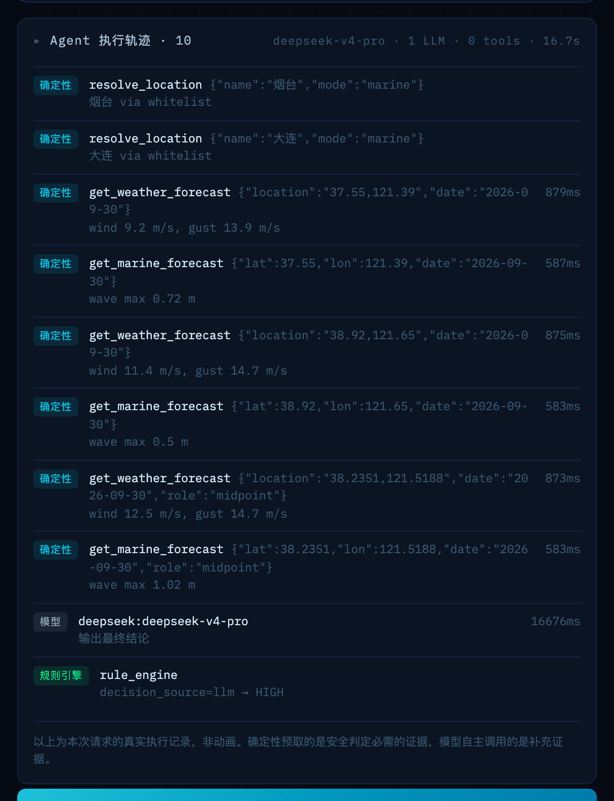

# 架构细节

> 概览见 [README](../README.md)。这份文档讲每个设计决策的具体依据和实现。

## 目录

- [证据分层](#证据分层)
- [决策可追溯](#决策可追溯)
- [Abstention：第四种结论](#abstention第四种结论)
- [规则引擎 verifier](#规则引擎-verifier)
- [可达性契约](#可达性契约)
- [地名解析：两道关](#地名解析两道关)
- [可达性清单 ≠ 数据源清单](#可达性清单--数据源清单)
- [航路建模](#航路建模)

---

## 证据分层

系统把证据分成两类，边界写死在代码里：

| | **必需证据** | **补充证据** |
|---|---|---|
| 谁去取 | `evidence.py` 确定性预取 | 模型自己决定调不调 |
| 内容 | 两端风速 / 能见度；船舶再加两端有效浪高 | 气象预警搜索、第三地（经停/备降场）天气 |
| 缺了怎么办 | **abstention，明确说"无法判断"** | 无所谓，结论正确性不依赖它 |
| 进不进规则引擎 | 是，规则引擎只看它 | 否 |

**为什么必需证据不交给模型去调工具**：AgentAbstain（[arXiv 2607.10059](https://arxiv.org/abs/2607.10059)，2026-07）
实测最强模型在成对弃权任务上只有 **59.5%** 准确率，且论文发现**弃权能力与通用任务能力基本无关**——
把模型换强并不能解决这个问题。安全关键证据的获取，不能取决于模型这一次想不想调工具。

这个结论在本项目的 L1 评测里[复现了](evaluation.md#弃权是模型最不可靠的能力)：
四家模型 24 次弃权机会错过 21 次，且 21 次全部判 `LOW`。

模型的自由裁量空间仍然是真实的（它可以一次工具都不调直接下结论，也可以主动去查预警和第三地），
只是这份自由不承担安全责任。

**模型的联网搜索结果不具备判定资格**——它进不了 `bundle`，规则引擎看都不看。
搜索允许失败（DDGS 从数据中心 IP 常被限流），失败只在 trace 里显示，结论不受影响。

---

## 决策可追溯

结果页可以展开本次请求的**真实**执行记录：每一步的类型（确定性预取 / 模型自主 / 模型 / 规则引擎）、
实际参数、实际耗时、成功还是失败。工具失败会显眼地标红，不会被吞掉。



配合 evidence 里每个数值都带的 `source` 与 `fetched_at`，每个结论都能追到**是哪个源、什么时候取的哪个数**。
这正是 TelemetrySuffBench（[arXiv 2608.07899](https://arxiv.org/abs/2608.07899)）说的
"explicit decision-to-provenance links"。

---

## Abstention：第四种结论

`risk_level` 有第四种取值 **`UNKNOWN`**。触发时前端显示石板灰的「证据不足」，
**不显示出行建议徽章**（`is_go_recommended` 为 `null`——没有依据就不能落成"不建议出行"），
并列出到底缺了什么、该去查哪个官方渠道。


触发条件（任一命中）：

- 出行日期超出可用预报范围
- 任一端大气数据不可得，或缺必需字段（航空还要求能见度——那是硬红线，缺了就不能排除高风险）
- 船舶出行且任一端拿不到浪高：坐标解析失败、回验判定非海域、或海洋 API 挂了
- 航空出行且任一端不在民航机场清单内

缺失码分两类，**文案必须让用户分得清**：

| 类型 | 缺失码 | 对用户意味着 |
|---|---|---|
| 系统没拿到数据 | `atmos_unavailable` / `wind_missing` / `visibility_missing` / `wave_height_missing` / `location_unresolved` / `date_out_of_range` | 数据源出问题了，或者日期超出预报范围，换个时间再试 |
| **范围边界** | `not_coastal` / `no_airport` | 不是系统坏了，是这个查询本来就不在覆盖范围内 |

**判定权在规则引擎，不在模型。** system prompt 里也给了模型一个出口
（Anthropic 评测指南：*"give the LLM a way out, like providing an instruction to return 'Unknown'
when it doesn't have enough information"*），但那只是第二道保险。

---

## 规则引擎 verifier

站在模型循环之外的一层，做三件事：

- **Abstention**：证据不足 → `UNKNOWN`，优先于一切
- **Override UP**：气象数据越过硬红线但 LLM 判低了（包括模型弃权）→ 强制升级
- **Override DOWN**：LLM 判了 `HIGH` 但结构化指标不支持 → 降级。**只对 HIGH 生效**——
  `MEDIUM` 代表 LLM 对多因素边缘组合（如接近阈值的风速叠加雷暴）的综合判断，
  硬阈值捕获不了，应予保留

输出 `decision_source` 字段透出走了哪条路径：`llm` / `rule_override_up` / `rule_override_down` /
`rule_only` / `llm_abstain` / `abstain_insufficient_evidence`。

模型完全不可用时（输出无法解析、API 挂掉、超时），规则引擎走 `rule_only` 独立出结论——
这条路径在 L1（glm-5 有 5 条输出无法解析）和 L2 的三组故障注入里都验证过。

### 判据结构：两条轴

- **轴 A 禁限航（`REG`）**：官方明文"禁止/不得"的条款。**只有这个配得上"依规不得开航"的措辞。**
  小船 ≥6 级禁止出海；大船 ≥7 级不得允许旅客、车辆上船。航空**没有通用禁飞线**——明说这一点，不假装有。
- **轴 B 官方预警（`WARN`）**：气象/海洋部门的四色预警发布标准。只说"已达 X 色预警发布标准"，不预测后果。

完整阈值与出处见[知识库](knowledge-base.md)。三点说明：

- **阈值语义是严格的**：`≥` 表示边界值本身触发，`>` 表示不触发，禁止四舍五入。
  评测里用 10.7/10.8（航空、小船各一组）、13.8/13.9、14.9/15.0、0.39/0.41 km、2.4/2.5 m
  共 5 个阈值、6 组边界对照验证精度。
- **大风预警同时看平均风与阵风，取「或」关系**——实测烟台→大连航线上，
  触发预警的常常是阵风而不是平均风。
- **船型只影响禁航线（6 级 vs 7 级），不影响浪高**。因为官方只给了分船型的风速禁航线，
  没给分船型的浪高线。唯一的例外是那条标注为 `PROD` 的小船浪高规则。

### 输出契约

`rules.evaluate()` 返回的 `triggers` 是**结构化触发项列表**，由规则引擎产出、模型不参与，
每条带 `cls`（REG/WARN/PROD）、`text`、`source`、`source_url`。前端按来源类型渲染徽章。
MEDIUM / HIGH 结论的 `core_reason` 末尾强制附「以官方通知为准」（UNKNOWN 走弃权文案，另给官方渠道指引）。

**触发项文案不经模型**，避免措辞在模型手里被稀释成"可能有一定风险"这类没有信息量的话。

---

## 可达性契约

一个安全工具最危险的失败不是判错等级，而是**在一个根本不成立的前提上给出自信的结论**。
两条路径都要有独立的可达性校验。

| | 校验方式 | 清单外的行为 |
|---|---|---|
| 海事 | `PORTS` 白名单（80 个）+ 坐标解析 + 海域回验 | `not_coastal`，弃权 |
| 航空 | `AIRPORT_CITIES` 白名单（149 个有民航机场的城市）| `no_airport`，弃权 |

**航空侧需要独立校验，因为它没有天然的判别器。** 船舶侧因为需要浪高，
顺带得到一个校验——Open-Meteo Marine 对内陆点返回全 null。而航空判据只要风速和能见度，
**任何地名都能查到这两样**，所以"上海→南极"这类查询必须靠白名单拦。

清单刻意不追求完整：**漏收一个支线机场会导致弃权（安全方向），
错误放行一个不存在的航点会导致"建议出行"（危险方向）**——两种错误的代价不对称。

### 弃权文案分两类

范围边界和系统失败对用户是完全不同的信息：

| 情况 | 文案 |
|---|---|
| `上海→拉萨`（船）| "该地点不临海" |
| `杭州→南京`（船）| "不临海。**内河与湖泊航线不在覆盖范围内**——内河另有一套官方标准，判据是风力分档且不含浪高" |
| `上海→南极`（飞机）| "该地点不在已收录的民航机场清单内" |
| 海洋 API 挂掉 | "未能取得有效浪高数据" |

---

## 地名解析：两道关

Open-Meteo Geocoding 是**模糊匹配**。搜 `Xian` 返回的是
`Xián(西班牙) / Xianning / 咸阳 / 湘潭市 / 珠海市`——**里面没有西安**。
只按人口排序取第一个，就会拿珠海的海况去回答关于西安的问题。

所以坐标解析有两道关：

1. **名字校验**（`_name_matches`）：候选地名必须与输入对得上（双向前缀匹配，`杭州` ↔ `杭州市`）。
   中文库匹配不上再用英文库查一次，罗马化输入走这条。
   **「取人口最多」只用于在同名候选里挑一个，不用于在毫不相干的候选里挑一个。**
2. **海域回验**（`nearest_marine_point`）：在 **50 km** 半径内搜最近的有浪高数据的网格点，
   搜不到即判非海域。半径是实测定的——可通海城市（杭州/嘉兴/台州）最近海域都在 50 km 内，
   内陆城市（南京/镇江/武汉/郑州）都在 100 km 外，余量很大。

第二道关判的是**城市**不是**像素**：杭州在杭州湾湾顶，市中心坐标本身没有海洋数据，
但往东 50 km 就有；同类的还有绍兴、嘉兴、台州。

L3 里有一组断言专门钉死这两道关：内陆地名（含 `Xian` / `Xi'an` / `Beijing` 这类罗马化输入）
不许被放行，同时 `Hangzhou` 必须与 `杭州` 解析到同一坐标——**既不放行错的，也不误伤对的**。

---

## 可达性清单 ≠ 数据源清单

这是两件事，**合一会让覆盖塌缩**：

| | 可达性（宽）| 数据源（窄）|
|---|---|---|
| 航空 | `AIRPORT_CITIES` 149 个，决定"能不能评估" | `AIRPORTS_WX` 38 个机场（40 个键，含别名），决定"用官方还是回落" |
| 海事 | `PORTS` 80 个 + 坐标解析兜底 | wttr.in + Open-Meteo Marine |

航空数据源因此是**分级**的而不是二元的：

| 情况 | 数据源 | 证据里的标记 |
|---|---|---|
| 38 个机场 + TAF 覆盖整天 | 官方 METAR/TAF | `quality: full` |
| TAF 只覆盖部分时段 | 官方 + 城市地面天气补齐，取合并极值 | `quality: mixed`，并透出官方预报覆盖到几点 |
| 其余机场，或超出 TAF 范围 | 城市地面天气 | `quality: city_surface` |

拆开看航空判据就知道为什么可以这样分级：

| 判据 | 城市地面天气够不够用 |
|---|---|
| 大风预警（平均风/阵风四色）| **完全够用**——大风预警本来就是**对区域**发布的，城市地面风正是它的输入 |
| LVTO 能见度（RVR < 400m）| 真的是近似——城市能见度 ≠ 跑道 RVR |
| 侧风 15 m/s | 本来就是分机型分道面的近似，已标 `PROD` |
| 雷暴（天气描述含雷暴）| 用的是天气现象描述，城市与机场差别不大；已标 `PROD` |

三条里只有一条真的需要跑道观测。**对一个决策工具来说，覆盖率本身就是产品质量**——
一个大多数查询都回答"证据不足"的安全工具不会让任何人更安全。前端会明确提示哪次用了城市地面天气：
**该说清楚的是数据的出处和局限，不是把用户挡在门外。**

---

## 航路建模

### 海事：按距离多点采样

跨海航线的风险由**开阔水域的中段**决定，两端港口是遮蔽水域，会低估。
实测 2026-02-05 渤海海峡全线停航当天：**烟台港平均风只有 8.0 m/s（大风蓝色），
海峡中部却是 15.2 m/s（7 级，已越过客运禁航线）、阵风 21.3 m/s（大风黄色）。**
只采港口会把这次停航判成中风险。

采样点数按距离定（每 ~200 km 一个，上限 5）。有一个几何限制值得说清楚：
**中国海岸线是弯的，远距离两港之间的大圆直线会切进内陆。** 实测：

| 航线 | 距离 | 采样点落在海上 |
|---|---|---|
| 厦门→金门 | 23 km | 1/1 |
| 烟台→大连 | 154 km | 1/1 |
| 青岛→上海 | 538 km | 2/2 |
| 上海→厦门 | 845 km | **0/4** |
| 天津→北海 | 2117 km | **0/5** |

所以采样点会**自过滤**——取不到浪高的点说明它落在陆地上、不在真实航路上，
丢掉并把覆盖情况如实透出（`route.on_water`），trace 里标为「该点位于陆地，已从航路采样中剔除」
（这是设计内的过滤成功，不画成失败）。若航程 >300 km 且**所有**采样点都落在陆地，结论降级为 `quality: partial`
并明确告诉用户"未覆盖航程中段"，而不是拿陆地上的地面天气冒充航路气象。

**这个限制在实践中影响很小。** IMO 航行计划准则（A.893(21)）要求对整个航程预见不利天气，
但真实做法分两类——中国气象局的资料说得很直白：**"远洋导航有很多航线选择……
而短途航运通常关注更简单的导航需求"**：

- **远洋长航线**：有一整个「气象导航」行业在做避台和绕航，核心动作是**改航线**，不是停航
- **短程横渡**：整条航线在同一个天气系统里，**没有绕的余地**，决策就是二元的停或不停

中国沿海的定期客运几乎全是后者——渤海海峡 154 km、琼州海峡 26 km、厦门-金门 23 km。
长途沿海定期客运已基本被航空和铁路替代（上海到香港没有定期客运轮渡，只有邮轮）。

### 航空：SIGMET

航空不做航路采样，接的是 **SIGMET**——航路危险天气的 **ICAO 官方产品**，
中国各飞行情报区都在发布（严重积冰、嵌入性雷暴、热带气旋），数据带多边形几何，
可判断航路是否穿越。

**触发时定 `MEDIUM` 而不是 HIGH**，因为真实处置顺序是先绕、绕不过才取消：

```
航路有雷雨 → ① 申请绕飞 → ② 不批准则返航/备降
           → ③ 大范围覆盖绕不过，或起降机场长时间被覆盖 → 等待或取消
```

民航局的十二类不正常原因统计佐证：2025 年**空管（含流量）原因仅占 0.02%**，
而流量限制正是航路绕飞在运行上的主要体现。**航路天气主要被吸收成延误，很少构成取消的独立原因。**

**只用于当天查询**：SIGMET 有效期只有 4–6 小时。文案带上有效期，让用户拿它对自己的航班时间。

**只在两端都属于 38 个官方气象机场时检查**：航路要用两端机场坐标来算，只走城市地面天气的机场城市没有坐标，这类航线不做航路危险天气检查。
